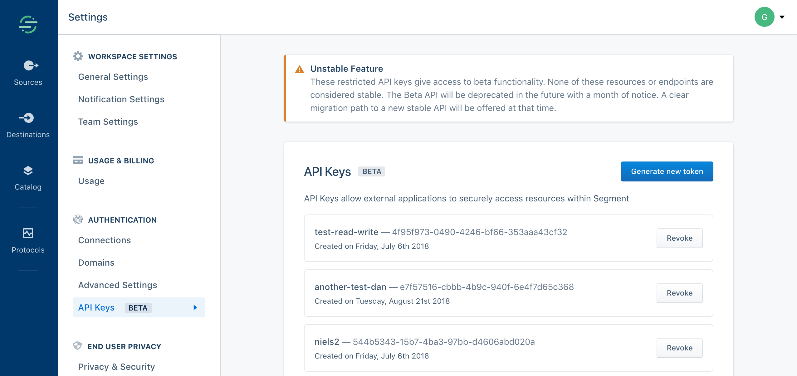
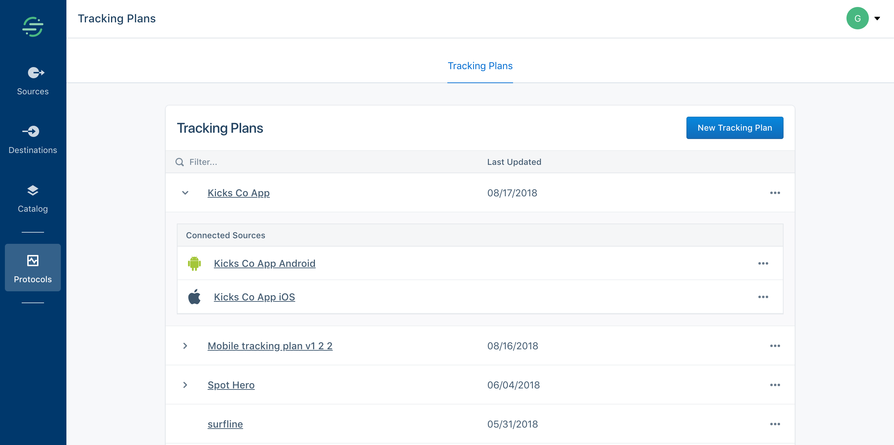
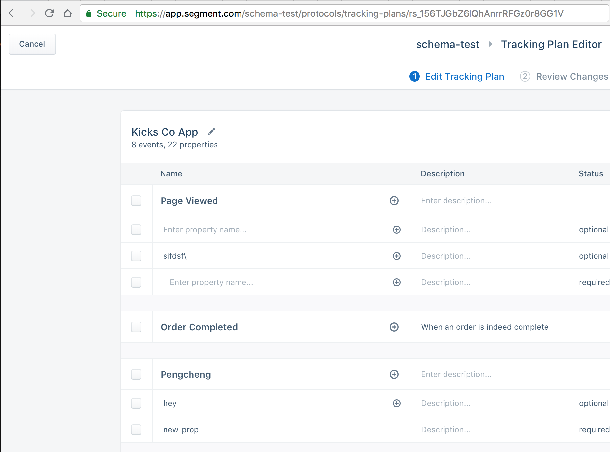

# typewriter project integration examples

The example projects in this repo give some high level guidance as to how you can instrument
the typewriter library into your applications.

By default, [a local Tracking Plan file is used within the projects](https://github.com/segmentio/typewriter-examples/blob/master/typescript-project/tracking-plan.json) - to use a hosted version, a `typewriter-remote` task exists --  [update it with a Tracking Plan Id, and API Token](https://github.com/segmentio/typewriter-examples/blob/master/typescript-project/package.json#L8) 

## API Token

To obtain an api token, navigate to https://app.segment.com/{YOUR_WORKSPACE_NAME}/settings/api-keys and click "Generate new token"

## Tracking Plan ID

To obtain a Tracking Plan id, navigate to the tracking plan index page at https://app.segment.com/{YOUR_WORKSPACE_NAME}/protocols/tracking-plans 

 

Select the Tracking Plan you'd like to generate a library for, and take note of the id in the URL:

 

#### TODO: Examples for additional languages
- Java
- iOS
- Go
- Swift
